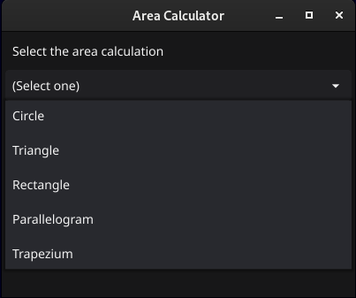
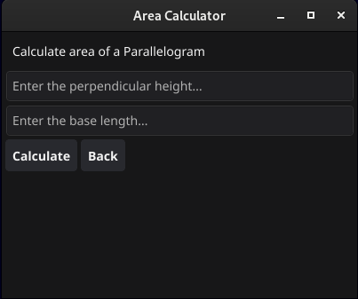

# GUI Based Go Calculator

This is a simple gui calculator written in Go with fyne. It supports various geometric shapes and calculates their areas based on user input.

This is the gui version of [same cli calculator](https://github.com/Kenura-R-Gunarathna/go-calculator.git)

<div style="display:flex;">
    
    
</div>

## Features

- Calculate the area of a circle
- Calculate the area of a triangle
- Calculate the area of a rectangle
- Calculate the area of a parallelogram
- Calculate the area of a trapezium

## Prerequisites

- Go installed on your machine. You can download and install it from [here](https://golang.org/dl/).

## Usage

1. Clone this repository to your local machine:

   ```bash
   git clone https://github.com/Kenura-R-Gunarathna/go-gui-calculator.git
   ```

2. Navigate to the project directory:

   ```bash
   cd go-gui-calculator
   ```

3. Run the program:

   ```bash
   go run .
   ```

4. Follow the on-screen instructions to perform calculations.

## Build

You can obtain the compile version of the app also using the command.

1. For Mac OS:

   ```bash
   go install fyne.io/fyne/v2/cmd/fyne@latest
   sudo ~/go/bin/fyne package -os darwin
   ```

2. For Linux:

   ```bash
   go install fyne.io/fyne/v2/cmd/fyne@latest
   sudo ~/go/bin/fyne package -os linux
   ```

3. For Windows:

   ```bash
   go install fyne.io/fyne/v2/cmd/fyne@latest
   sudo ~/go/bin/fyne package -os windows
   ```

This is the compiled app for Linux : [Download Now](./bin/gui_calculator.tar.xz).

Or you can refer https://docs.fyne.io/started/packaging for more details.

## Contributing

Contributions are welcome! If you have any ideas for improvement or find any bugs, feel free to open an issue or submit a pull request.

## License

This project is licensed under the [MIT License](LICENSE).
